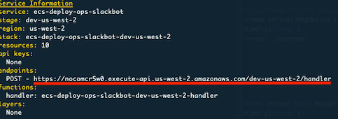

# ecs-deploy-ops-slackbot

Slack Bot for ECS Service Deployment and get Instance IDs.

## Bot Usage

```
@<bot-user-name> : ECS deploy interactive menu
@<bot-user-name> <instance name prefix> : Return instance Ids
```

## Requirement

- serverless >=1.39.x
- Go >=1.1

## Get Started

1. Create Slack bot user
   - https://api.slack.com/apps
2. Create conf yaml file for serverless.yml

   ```
   $ cp conf/stage.yml.sample conf/YOUR-STAGE-NAME.yml
   ```

   - How to Get slack token
     - Verification Token
       - **Axxxxxx is your slack bot's App ID**
       - https://api.slack.com/apps/Axxxxxx
         - App Credentials
     - Bot User OAuth Access Token
       - https://api.slack.com/apps/Axxxxx/oauth

3. Deploy to AWS

   - `YOUR-STAGE-NAME` is needed to match env yaml file name you created before.

     ```
     $ sls deploy -v --stage YOUR-STAGE-NAWE
     ```

4. Configure Slack Event Subscriptions

   https://api.slack.com/apps/Axxxxx/event-subscriptions

   - Set your API Gateway endpoint to `Request URL` (See `sls deploy` output)

     

   - Configure `Subscribe to Bot Events`
     - only `app_mention`

5. Configure Interactive Components

   - https://api.slack.com/apps/Axxxxx/interactive-messages
   - Set your API Gateway endpoint to `Request URL` (See `sls deploy` output) same as 4.
   - Other settings is not required

6. Encrypt Slack tokens set with lambda's environment variable

- Create key in KMS
  - In Define key usage permissions,
    - Choose lambda's role, `ecs-deploy-ops-slackbot-YOUR-STAGE-NAME...-lambdaRole`
- Set encrypt with lambda web console

  - Once you set, you don't need to set again every time you deploy

    
